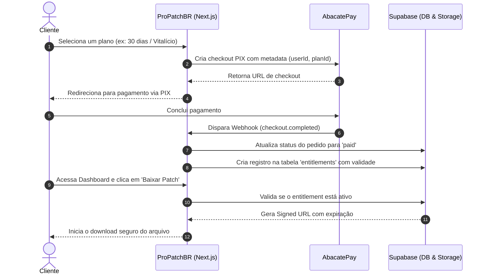

# 🎮 Pro Patch BR

Plataforma moderna de comércio eletrônico e distribuição protegida de patches e mods para **Winning Eleven 10 (PS2 / OPL)**.

O sistema automatiza todo o fluxo de ponta a ponta: autenticação social do usuário, checkout transparente via PIX (AbacatePay), concessão automática de licenças (*entitlements*) via webhooks e entrega de downloads seguros através de URLs assinadas.


---

## ✨ Funcionalidades Principais

- 🔐 **Autenticação Social:** Login seguro via Google gerenciado pelo Supabase Auth com persistência de sessão por cookies SSR.
- 🛒 **Checkout PIX Automatizado:** Integração com AbacatePay para emissão instantânea de cobranças via PIX com metadados vinculados ao usuário.
- ⚡ **Liberação Instantânea (Webhooks):** Processamento assíncrono de eventos `checkout.completed`, gerando o pedido e ativando a licença (*entitlement*) em tempo real.
- 🛡️ **Download Protegido & Anti-Pirataria:** Arquivos hospedados em bucket privado com entrega via **URLs assinadas temporárias** geradas sob demanda para assinantes ativos.
- ⏱️ **Modelos Flexíveis de Acesso:** Suporte a planos mensais (30 dias), trimestrais (90 dias) e licença vitalícia (*lifetime*).
- 📊 **Dashboard do Cliente:** Painel onde o cliente acompanha seus patches ativos, validade de licenças, changelog de versões e links de download.
- 🔒 **Segurança em Nível de Linha (RLS):** Todas as tabelas sensíveis protegidas no PostgreSQL por políticas de Row Level Security.

---

## 🛠️ Stack Tecnológica

- **Frontend:** Next.js 16 (App Router, Server Actions, Turbopack), React 19, TypeScript, Tailwind CSS, Lucide React, Radix UI.
- **Backend & Banco de Dados:** Supabase (PostgreSQL, Auth, Storage, Row Level Security).
- **Validação de Dados:** Zod.
- **Gateway de Pagamento:** AbacatePay API (PIX automatizado).
- **Hospedagem Recomendada:** Vercel.

---

## 🏛️ Arquitetura do Projeto

O projeto adota uma arquitetura modular limpa e orientada a domínios:

```text
src/
├── app/               # Rotas e páginas (Next.js App Router)
│   ├── api/           # Endpoints de API (checkout, webhooks, downloads)
│   ├── dashboard/     # Painel autenticado do cliente
│   ├── planos/        # Página de seleção de planos
│   └── auth/          # Callbacks e fluxo de autenticação
├── core/              # Contratos e tipos centrais de domínio
├── infra/             # Integrações externas (Supabase, AbacatePay)
│   ├── payments/      # Cliente e chamadas da AbacatePay
│   └── supabase/      # Instâncias de cliente e servidor do Supabase
├── modules/           # Módulos verticais de negócio
│   ├── identity/      # Autenticação, perfis e ações de usuário
│   ├── orders/        # Pedidos, planos e pagamentos
│   └── products/      # Produtos, versões e entitlements
└── middleware.ts      # Proteção de rotas e renovação de sessão Supabase
```

---

## 🔄 Fluxo de Compra e Concessão de Acesso



---

## 🚀 Começando (Desenvolvimento Local)

### Pré-requisitos

- [Node.js](https://nodejs.org/) (v20 ou superior)
- Gerenciador de pacotes (`npm`, `pnpm` ou `yarn`)
- Conta configurada no [Supabase](https://supabase.com)
- Conta na [AbacatePay](https://abacatepay.com)

### 1. Clone o repositório

```bash
git clone https://github.com/jeannlucas/propatchbr.git
cd propatchbr
```

### 2. Instale as dependências

```bash
npm install
```

### 3. Configure as variáveis de ambiente

Crie o seu arquivo local a partir do modelo de exemplo:

```bash
cp .env.example .env.local
```

Preencha os valores no `.env.local`:

```env
# Supabase
NEXT_PUBLIC_SUPABASE_URL=https://seu-projeto.supabase.co
NEXT_PUBLIC_SUPABASE_ANON_KEY=sua-anon-key-publica
SUPABASE_SERVICE_ROLE_KEY=sua-service-role-key-privada

# AbacatePay
ABACATEPAY_API_KEY=sua-abacatepay-api-key
ABACATEPAY_WEBHOOK_SECRET=seu-abacatepay-webhook-secret
ABACATEPAY_BASE_URL=https://api.abacatepay.com

# URL da Aplicação
NEXT_PUBLIC_APP_URL=http://localhost:3000
```

### 4. Configure o Banco de Dados (Supabase)

1. No painel do seu projeto Supabase, acesse a aba **SQL Editor**.
2. Execute o conteúdo do arquivo `supabase/migrations/001_initial_schema.sql` para criar as tabelas (`profiles`, `products`, `product_versions`, `plans`, `orders`, `entitlements`, `download_logs`), enums e regras de RLS.
3. No menu **Storage**, crie o bucket privado utilizado para armazenar os patches.
4. No menu **Authentication > URL Configuration**, certifique-se de adicionar `http://localhost:3000/auth/callback` na lista de **Redirect URLs**.

### 5. Inicie o servidor local

```bash
npm run dev
```

Acesse [http://localhost:3000](http://localhost:3000) no seu navegador.

---

## 🔔 Testando Webhooks Localmente

Para simular o recebimento de confirmações de pagamento da AbacatePay em desenvolvimento:

1. Exponha sua porta local usando uma ferramenta de túnel (ex: [ngrok](https://ngrok.com/)):
   ```bash
   ngrok http 3000
   ```
2. No painel de desenvolvedor da AbacatePay, cadastre a URL pública gerada no seguinte formato:
   ```text
   https://seu-dominio-ngrok.ngrok-free.app/api/webhooks/abacatepay
   ```
3. Realize um pagamento em ambiente de testes/sandbox para verificar a criação automática da licença em `entitlements`.

---

## 📜 Scripts Disponíveis

| Comando | Descrição |
| :--- | :--- |
| `npm run dev` | Inicia o servidor local de desenvolvimento |
| `npm run build` | Compila a aplicação otimizada para produção |
| `npm run start` | Inicia o servidor em modo de produção compilado |
| `npm run lint` | Executa a verificação estática de código com ESLint |

---

## 📄 Licença

Este projeto está sob a licença [MIT](LICENSE).

---

## 🌐 Redes Sociais da Comunidade

- 📸 **Instagram:** [@propatchbr](https://www.instagram.com/propatchbr/)
- 📺 **YouTube:** [@ProPatchBR](https://www.youtube.com/@ProPatchBR)

---

Desenvolvido por [BigDev.Z - IT Consulting](https://bigdevz.com/).