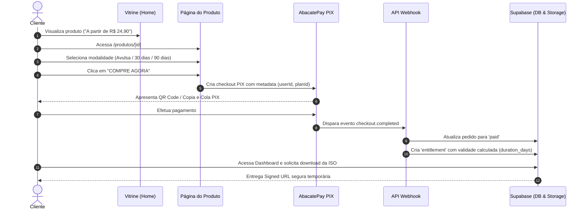

# 🎮 Pro Patch BR

Plataforma moderna de comércio eletrônico e distribuição protegida de patches e mods para **Winning Eleven 10 (PS2 / OPL)**.

O sistema gerencia todo o fluxo de ponta a ponta: vitrine com menor preço de entrada, página de produto com seleção de modalidades (versão avulsa vs. período de atualizações), checkout transparente via PIX (AbacatePay), concessão automática de licenças (*entitlements*) via webhooks e entrega de downloads seguros através de URLs assinadas.


---

## 🎯 Regras de Negócio e Modalidades de Acesso

O catálogo é estruturado no modelo **Vitrine ➔ Produto ➔ Escolha do Plano ➔ Compra**:

### 1. Na Vitrine (Home)
- Exibição focada e atraente apresentando apenas o **menor preço disponível**:
  > **A partir de R$ 24,90**

### 2. Na Página do Produto (`/produtos/[id]`)
Ao acessar o produto, o cliente escolhe a modalidade de acesso desejada antes de seguir para o checkout:

| Modalidade | Preço | Período de Atualizações | Descrição |
| :--- | :--- | :--- | :--- |
| **Versão Avulsa** | **R$ 24,90** | Nenhum (Acesso permanente à v1.0) | Compra da versão atual do patch para jogar imediatamente. *Não inclui atualizações futuras.* |
| **Atualizações 30 dias** | **R$ 34,90** | 30 dias de atualizações | Versão atual + direito a todas as novas ISOs, correções e transferências lançadas em 30 dias. |
| **Atualizações 90 dias** | **R$ 49,90** | 90 dias de atualizações | Melhor custo-benefício para a temporada: 3 meses completos de atualizações e suporte. |

---

## ✨ Funcionalidades Principais

- 🏷️ **Precificação Dinâmica e Centralizada:** Os valores e planos são gerenciados no banco de dados e sincronizados na AbacatePay, sem valores fixos no código.
- 🔐 **Autenticação Social:** Login rápido via Google com gerenciamento de sessão pelo Supabase Auth (SSR).
- 🛒 **Checkout PIX Automatizado:** Integração com AbacatePay com geração de link seguro e metadados vinculados ao usuário.
- ⚡ **Liberação Instantânea (Webhooks):** Processamento de eventos `checkout.completed` que calcula automaticamente a validade da licença (`duration_days`) e concede o *entitlement* em tempo real.
- 🛡️ **Download Protegido Anti-Pirataria:** Distribuição de arquivos ISO via Supabase Storage utilizando **Signed URLs temporárias** (expiram em 1 hora), acessíveis apenas por usuários com licença ativa.
- 📊 **Dashboard do Cliente:** Painel onde o cliente acompanha seus patches ativos, datas de validade e gera links de download.
- ⚙️ **Painel Administrativo (`/admin/planos`):** Interface para administradores editarem preços, nomes, prazos e IDs da gateway sem alterar código.
- 🔒 **Row Level Security (RLS):** Banco de dados PostgreSQL totalmente blindado com políticas de segurança por usuário.

---

## 🛠️ Stack Tecnológica

- **Frontend:** Next.js 16 (App Router, Server Actions, Turbopack), React 19, TypeScript, Tailwind CSS, Lucide React, Radix UI.
- **Backend & Banco de Dados:** Supabase (PostgreSQL, Auth, Storage, Row Level Security).
- **Validação:** Zod.
- **Gateway de Pagamento:** AbacatePay API v2 (PIX instantâneo).
- **Hospedagem Recomendada:** Vercel.

---

## 🏛️ Arquitetura do Projeto

O projeto adota uma arquitetura modular limpa e orientada a domínios:

```text
src/
├── app/                      # Rotas e páginas (Next.js App Router)
│   ├── (public)/             # Rotas públicas abertas
│   │   ├── page.tsx          # Vitrine com menor preço ('A partir de R$ 24,90')
│   │   ├── produtos/[id]/    # Página do produto com seletor interativo de planos
│   │   ├── checkout/         # Tela intermediária de checkout
│   │   └── login/            # Autenticação Google / E-mail
│   ├── (protected)/          # Rotas autenticadas
│   │   └── dashboard/        # Painel do cliente e gerador de downloads
│   ├── admin/                # Painel de administração
│   │   └── planos/           # Gerenciamento dinâmico de preços e planos
│   └── api/                  # Endpoints de backend
│       ├── admin/plans/      # API de gestão de planos
│       ├── checkout/         # Criação de cobrança na AbacatePay
│       ├── webhooks/         # Webhook de confirmação PIX
│       └── downloads/        # Gerador de URLs assinadas temporárias
├── components/               # Componentes compartilhados (ex: Footer com redes sociais)
├── core/                     # Entidades e contratos puros do domínio
├── infra/                    # Clientes de infraestrutura (Supabase, AbacatePay)
├── modules/                  # Módulos verticais de negócio
│   ├── catalog/              # Repositórios e regras de produtos e planos
│   ├── identity/             # Ações de usuário, perfil e autenticação
│   ├── orders/               # Pedidos e cobranças
│   └── entitlements/         # Concessão e validação de licenças
└── middleware.ts             # Proteção de rotas e renovação de sessão Supabase
```

---

## 🔄 Fluxo de Compra e Concessão de Acesso



---

## 🚀 Começando (Desenvolvimento Local)

### Pré-requisitos

- [Node.js](https://nodejs.org/) (v20 ou superior)
- Gerenciador de pacotes (`npm`, `pnpm` ou `yarn`)
- Conta configurada no [Supabase](https://supabase.com)
- Conta na [AbacatePay](https://abacatepay.com)

### 1. Clone o repositório

```bash
git clone https://github.com/jeannlucas/propatchbr.git
cd propatchbr
```

### 2. Instale as dependências

```bash
npm install
```

### 3. Configure as variáveis de ambiente

Crie o arquivo local a partir do modelo de exemplo:

```bash
cp .env.example .env.local
```

Preencha os valores no `.env.local`:

```env
# Supabase
NEXT_PUBLIC_SUPABASE_URL=https://seu-projeto.supabase.co
NEXT_PUBLIC_SUPABASE_ANON_KEY=sua-anon-key-publica
SUPABASE_SERVICE_ROLE_KEY=sua-service-role-key-privada

# AbacatePay
ABACATEPAY_API_KEY=sua-abacatepay-api-key
ABACATEPAY_WEBHOOK_SECRET=seu-abacatepay-webhook-secret
ABACATEPAY_BASE_URL=https://api.abacatepay.com

# URL da Aplicação
NEXT_PUBLIC_APP_URL=http://localhost:3000
```

### 4. Configure o Banco de Dados (Supabase)

No painel do Supabase, acesse a aba **SQL Editor** e execute em ordem:
1. `supabase/migrations/001_initial_schema.sql` (Estrutura básica de tabelas, enums e RLS).
2. `supabase/migrations/002_update_plans_pricing.sql` (Novos planos, preços oficiais de R$ 24,90 / R$ 34,90 / R$ 49,90 e políticas públicas).

No menu **Storage**, certifique-se de que existe o bucket privado `patches`.

No menu **Authentication > URL Configuration**, cadastre `http://localhost:3000/auth/callback` nas **Redirect URLs**.

### 5. Inicie o servidor local

```bash
npm run dev
```

Acesse [http://localhost:3000](http://localhost:3000) no seu navegador.

---

## 🔔 Testando Webhooks Localmente

Para simular o recebimento de confirmações de pagamento da AbacatePay em desenvolvimento:

1. Exponha sua porta local usando uma ferramenta de túnel (ex: [ngrok](https://ngrok.com/)):
   ```bash
   ngrok http 3000
   ```
2. No painel de desenvolvedor da AbacatePay, cadastre a URL do webhook apontando para:
   ```text
   https://seu-dominio-ngrok.ngrok-free.app/api/webhooks/abacatepay
   ```
3. Realize um pagamento em modo Sandbox/Teste para validar a ativação automática do plano no banco de dados.

---

## 📜 Scripts Disponíveis

| Comando | Descrição |
| :--- | :--- |
| `npm run dev` | Inicia o servidor local de desenvolvimento |
| `npm run build` | Compila a aplicação otimizada para produção |
| `npm run start` | Inicia o servidor em modo de produção compilado |
| `npm run lint` | Executa a verificação estática de código com ESLint |

---

## 🌐 Redes Sociais da Comunidade

- 📸 **Instagram:** [@propatchbr](https://www.instagram.com/propatchbr/)
- 📺 **YouTube:** [@ProPatchBR](https://www.youtube.com/@ProPatchBR)

---

## 📄 Licença

Este projeto está sob a licença [MIT](LICENSE).

---

Desenvolvido por [BigDev.Z - IT Consulting](https://bigdevz.com/).